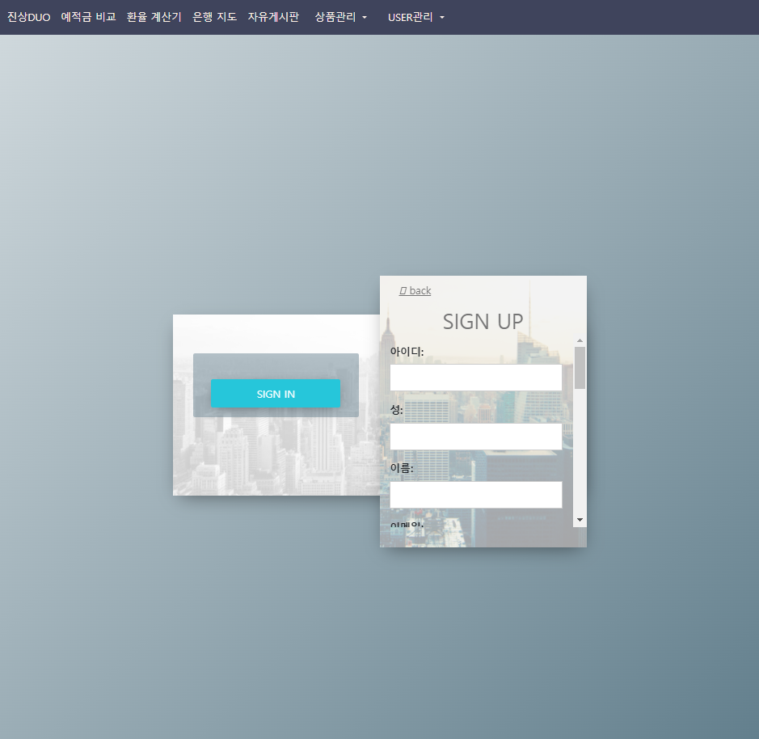

# 편리함을 선사하는 금융 통합 어플리케이션 - 진상DUO

금융상품 추천 웹 사이트인 진상DUO는, 개발에 참여한 오유**진**과 오민**상**에서 따온 이름입니다. 

웹사이트에서 지역과 직업이 같은 사람들이 많이 가입한 금융상품, 현재 가입한 금융상품에 대한 비교를 받아보세요.


### 1. 개발 기간
📅2023.11.15 ~ 2023.11.24

### 2. ERD


### 3. API 설계
a. main project
| HTTP verb | URL 패턴    | 설명                     |
| :-------- | :---------- | :----------------------- |
|           | `admin/`    | admin.site.url           |
|           | `accounts/` | include('accounts.urls') |
|           | `apis/`     | include('apis.urls')     |
|           | `articles/` | include('articles.urls') |


b. accounts app
| HTTP verb | URL 패턴                                    | 설명                               |
| :-------- | :------------------------------------------ | :--------------------------------- |
| POST      | `login/`                                    | 유저 로그인                        |
| POST      | `delete/`                                   | 유저 계정 삭제                     |
| POST      | `signup/`                                   | 유저 계정 생성                     |
| PUT       | `myinfo/`                                   | 내 정보 수정                       |
| GET       | `myinfo/<int:user_pk>/`                     | 내 정보 조회                       |
| GET       | `user/<int:user_pk>/`                       | 다른 유저의 계정 정보 조회         |
| GET       | `recommend_products_deposit/<int:user_id>/` | 정기예금 상품 추천                 |
| GET       | `recommend_products_save/<int:user_id>/`    | 정기적금 상품 추천                 |
| GET       | `graph/<int:user_id>/`                      | 현재 가입 상품 금리 비교           |
| GET       | `top3deposits/`                             | 지역별 / 직업별 top3 예금상품 추천 |
| GET       | `top3saves/`                                | 지역별 / 직업별 top3 적금상품 추천 |


c.apis app
| HTTP verb | URL 패턴                             | 설명                        |
| :-------- | :----------------------------------- | :-------------------------- |
| GET       | `deposit-products/`                  | 전체 정기예금 상품 조회     |
| GET       | `deposit-detail/<str:fin_prdt_cd>//` | 정기예금 상품 상세 조회     |
| GET       | `deposit-product-options/`           | 정기예금상품의 옵션 조회    |
| GET       | `deposit-bank/<str:kor_co_nm>/`      | 은행 별 정기예금 상품 조회  |
| GET       | `save-products`                      | 전체 정기적금 상품 조회     |
| GET       | `save-detail/<str:fin_prdt_cd>/`     | 정기적금 상품 상세 조회     |
| GET       | `save-product-options/`              | 정기예금상품의 옵션 조회    |
| GET       | `save-bank/<str:kor_co_nm>/`         | 은행 별 정기 적금 상품 조회 |
|           | `joindeposit/<str:deposit_id>/`      | 정기예금 상품 가입 취소     |
|           | `joinsave/<str:save_id>/`            | 정기적금 상품 가입 취소     |


d. articles app
| HTTP verb   | URL 패턴                            | 설명                       |
| :---------- | :---------------------------------- | :------------------------- |
| GET, POST   | `list/`                             | 게시판 이동 및 게시글 작성 |
| GET, DELETE | `<int:article_pk>/`                 | 게시글 조회 및 삭제        |
| POST        | `<int:article_id>/comments/`        | 게시글 댓글 작성           |
| DELETE      | `comments/delete/<int:comment_pk>/` | 댓글 삭제                  |


### 4. 프로젝트 소개
#### 1. 개발도구
- BE: Django 4.2.7
- DB: Sqlite3
- FE: Vue 3.3.4, pinia 2.1.7


#### 2. 설치방법
- 가상환경 생성 및 활성화
  ```
  $ python -m venv venv
  $ source venv/Scripts/activate
  ```
- requirements.txt 설치
  ```
  $ pip install -r requirements.txt
  ```
- 데이터베이스 migrate
  ```
  $ python manage.py migrate
  ```
- 유저 데이터 load
  ```
  $ python manage.py loaddata accounts/fixtures/accounts/user_data.json
  ```
- npm 설치
  ```
  $ npm install
  ```
- .env 파일 생성
  ```
  back 폴더 내 최상위 경로에 .env 파일 생성 후 아래 코드 작성

  EXIM_KEY='한국수출입은행 open APIkey'
  API_KEY='금융감독원 open APIkey'
  ```
- 서버 on
  ```
  $ python manage.py runserver
  $ npm run dev
  ```
- 로그인 후 예적금비교 사이트 조회하여 db에 저장
  
- 유저의 금융 상품 가입 데이터 load
  ```
  $ python manage.py loaddata apis/fixtures/apis/join_deposit_data.json
  $ python manage.py loaddata apis/fixtures/apis/join_save_data.json
  ```
#### 3. 주요기능
**a. 회원가입 페이지**


- 직업 탭의 경우 필드에서 선택
- 주소 탭의 경우 클릭 시 주소 검색 을 통한 작성
<hr>

**b. 로그인 페이지**


- 아이디 또는 비밀번호가 틀리면 알림 표시
<hr>

**c. 메인화면**


<hr>

**d. 예적금 비교**


- 실시간으로 은행에서 제공하는 정기예금과 정기적금 상품을 보여줍니다.
- 상품 클릭 시 해당 상품의 상세 정보를 조회 할 수 있습니다.
<hr>


**e. 환율 계산기**


- 환율 계산기를 통해 현재 환율에 따른 변환된 금액을 볼 수 있습니다.
<hr>

**f. 은행 지도**


- 은행 지도를 통해 해당 지역의 특정 은행 지점 위치를 확인 할 수 있고, 길찾기 기능을 제공합니다.
<hr>

**g. 자유 게시판**


- 자유게시판에 글을 작성 할 수 있습니다.
- 작성자만 본인이 작성한 게시글을 지울 수 있습니다.
- 댓글또한 본인이 작성한 댓글만 지울 수 있습니다.

**h. 상품관리**

   **h-1. 직업별 인기 예적금 상품**

  
  - 직업별 인기 예적금 상품을 조회 할 수 있습니다.
  - 상품 클릭시 해당 상품의 상세 정보를 확인 할 수 있습니다.

  **h-2. 지역별 인기 예적금 상품**

  
  - 지역별 인기 예적금 상품을 조회 할 수 있습니다.
  - 상품 클릭시 해당 상품의 상세 정보를 확인 할 수 있습니다.

  **h-3. 나의 상품 금리**

  
  
  - 내가 가입한 예적금의 상품의 금리를 비교 할 수 있습니다.
<hr>

**i. 내 프로필**


- 내 프로필에서 내 정보를 수정할 수 있습니다.
- 나에게 추천하는 상품의 목록을 조회 할 수 있습니다.
- 추천 알고리즘은 같은 직업, 같은 지역에 사는 사용자들이 가장 많이 가입한 상품을 추천합니다.
<hr>

### 5. 협업 과정


### 6. 회고

#### 오유진


**a. 추가하고 싶은 기능들**

> **a-1. front-지역별 TOP3 제품**
>>    - 반응형 한국 지도 모달과 함께 TOP3 제품 알림 <br>
      추가적인 구현으로 지역별 / 직업별 많이 가입한 제품을 화면에 띄웠다.
      d3라는 라이브러리를 발견해서 이를 활용해서 반응형 화면을 만들어 보고 싶었으나, 시간 부족으로 하지 못했다. <br>
      '정보 제공' 애플리케이션이라 글이 많지만, 조금 더 직관적인 전달을 위해 모달들도 사용하면 더 좋을 것 같았다. 데이터의 중요성을 잘 아는 만큼 전달도 중요하다고 생각하는데, 필수 요구사항을 충족하며 더 추가적인 기능을 많이 하지 못해 아쉽다. 

> **a-2. back-환율 계산기**
>>    - 시간별 저장 기능 <br>
      환율 정보 제공 시간은 짧은 편인데, 실시간으로 값을 제공하고자 따로 DB에 저장하지는 않았다. 하지만, DB에 저장해 둔 정보가 없어 환율 정보 제공 시간이 지나면, 정보를 알 수 없다는 단점이 있었다. 시간이 된다면 이 부분을 보완하고 싶다.

>  **a-3. front- 예·적금 금리 비교**
>>    - 도전과제 도전 <br>
      금리 변동에 따른 알림 기능을 추가해 보고 싶다.
>>    - join_deny <br>
      가입 한도가 제품마다 다르다는 것을 알게 되었다
      우선, 최소한도인 1에 맞추어서 가입하도록 하였는데, join_deny가 더 많은 상품이라면 여러 개 가입할 수 있도록 수정하고싶다. 
    
>  **a-4. front-근처 은행 검색**
>>    - 더 다양한 기능과 vue3 문법 <br>
      현재는 은행 찾기와 은행지점 이름, 그리고 길찾기까지 해 두었다.
      다만 KakaoMapsAPI 공식 문서를 보다 보니 정말 많은 다양한 기능들이 있어서, 이를 활용한 기능들을 더 추가해 보고 싶다. 그리고, 현재는 vue2 문법이 많이 섞여 있어 console 창에 노란 경고창이 뜨는데, vue3 문법으로 더 수정해서 보완하고 싶다. 
  
>  **a-5. 커뮤니티(게시판)**
>>    - category별 게시글 분류 기능 <br>
      금융 상품은 이번 프로젝트에서 사용한 예금/적금 이외에도 다양한데, 이런 분류별로 따로 게시글을 볼 수 있다면 더 좋을 것 같다. 
>>    - 좋아요 기능 <br>
      좋아요 해둔 게시글들을 추후에 확인할 수 있으면 더 편할 것 같다.
      애플리케이션 특성상 정보 글들을 나중에 모아 보고 싶을 것이라 필요한 기능으로 판단된다. 

**b. 회고록** <br>
> PPT를 만든 이후 이 색을 스포이트 기능으로 따서 vue에서 색을 활용했다. 그런데, navbar에서 조금 색이 다르게 떠서 아쉬웠다. 더 통일감 있게 만들 수 있었을 텐데! 

> 싸피에서의 첫 팀 관통 프로젝트여서 재미있었다. 여태까지 우리 반 금융 선택자들은 혼자 프로젝트를 해왔는데, (혼자도 가능할 거라는 강사님의 설명이 있었고, 실제로도 시간 내에 혼자 할 수 있었었다.)정말 오랜만에 팀플레이를 하니까 재미있었다. 간트차트 템플릿부터 받아와서 계획하고, 사용할 ERD와 각자 구현할 기능(우리 팀은 기능별로 분담함)을 미리 나누었다. 이 과정에서 다른 팀들보다 조금 더 많은 시간이 소요됐지만 미리 계획하는 게 편한 나에게는 좋은 시간이었다. 

> 카카오 맵으로 지도를 구현할 때, 다양한 기능들과 자세한 설명이 있어서 감동하였다. API KEY는 script 내에 작성해야 하는데, 이를 가리는 방법을 아직 찾지 못했다. 많이 검색해 보았지만, 다른 사람의 API 키를 많이 보게되었다... 이 부분은 아쉽지만, API 기능을 잘 구현하고 보기 좋은 문서로 만든 분들을 존경하게 되었다. 나도 언젠가 이렇게 기능을 잘 구현하고 상세하게 알려줄 수 있는 사람이 되고 싶다! <br><br>
환율 계산기 기능 구현 중 프론트에서 환율정보를 받아오려다가 실패했었다. cors 에러를 수정하기 위해 back이 아닌 front에서 어떻게든 해보고 싶었으나, 기능 구현을 시도하고 하루가 지날 때는 포기했고, back에서는 금방 구현할 수 있었다. cors 에러를 어떻게 해결해 나가야 할지 더 고민해 봐야 할 문제 같다. <br><br>
이 이후 금리정보를 받아올 때는 front에서 시도해 보다가, 시간이 걸려서 과감히 back에서 serializers를 생성해서 전달했다. 이 기능 구현을 하면서 '역시 데이터는 back이지!'라고 생각하게 되었다. 다만, user 정보 auth key와 함께 가입/취소 기능을 구현할 때, 너무 어려워서 join 정보는 apis 앱에서 구현하게 되었다.
조금 더 편리한 사용을 위해서 auth에 접근하는 방법을 더 공부해야 할 것 같다. <br><br>
알고리즘을 위해 사용할 항목들을 따로 사용자들에게 제공하는 것도 좋을 것 같았다. 그래서 사용자가 가장 많은 지역별/직업별 TOP 3 제품들을 제공하는 페이지를 만들게 되었는데, 잘한 것 같다. <br><br>
지역/직업 항목만 알고리즘에 사용한 이유가, 이번 프로젝트에서 통계청이나 다른 통계 기관들의 정보를 인용한 것이 아닌, python 코드를 직접 수정해서 랜덤 데이터를 받아온 것이어서 상관계수가 너무 낮음을 알게 되었다. 그래서, 직업군(주로 직업군별로 연봉이 비슷하다고 가정), 지역(지역별로 은행 선호도가 다르다는 뉴스 참고)하여 이 두 개 항목을 활용하여 알고리즘을 구현하게 되었다. br><br>

>알고리즘 구현 과정은 아래처럼 계획해서 구현하게 되었다. 
> 1. 모든 상품 리스트를 sort 하여 가입자가 많은 순으로 나열
> 2. 상관도 높은 항목을 활용하여 선호도 낮은 제품을 제외
> 3. 제외 후 남은 상품 중 인기 있는 순으로 추천
>
> 이 과정에서 처음에 작성한 코드는 너무 많은 정보를 front로 전달하여 성능이 떨어져, 다시 수정해서 최대한 거른 이후 전달하도록 했다. 알고리즘을 싸피에서 배웠었지만, 이런 문제에 적용하는 것은 낯설어서 쉽지는 않았지만, 흥미로운 작업이었다.

> 계속 아쉬운 점을 적게 되었는데, 되돌아보면 구현한 기능들이 많이 있다. 메인 페이지(nav-bar, 홈 화면), 예·적금 금리 비교와 디테일 페이지, 그리고 가입/취소, 환율 계산기, 근처 은행 검색, 커뮤니티 게시글 삭제 기능, 추가로 구현한 지역/직업별 실시간 통계 기능, 더미 데이터 생성부터 알고리즘 작성, ERD 작성, CSS로 애플리케이션의 색상을 통일한 것까지. 많다!! 
> 물론 CSS는 아쉬운 점이 많이 있지만, 그래도 기능들 잘 구현하고 문제 없이 작은 창/큰 창에서 실행된다. 처음 싸피에 왔을 때에는 반응형 앱을 만들지 못했는데, 이제는 크기도 고려해서 만들게 되었으니 성장했다고 봐야겠지? 

> 대문자 소문자, 그리고 생략한 글자!!!! front 작업을 할 때, 기능 구현에 문제가 있는 줄 알고, 하루 종일 다른 코드로도 생각해서 구현해보고 했는데, 계속 오류가 났었다. 이 원인이 내가 잘못 적은 글자 하나였을 줄이야 :(  이걸 알았을 때 너무 허무하고, 화도 나고, 왜 이걸 일찍 발견하지 못했는지 나를 많이 자책했다. 글자를 잘 읽었으면, 처음에 잘 적었으면 더 빨리 기능을 구현하고 다른 작업도 할 수 있었을텐데. 그래도 front작업을 할 때 print(err), console.log(err)을 많이 사용해서 점점 오류가 어디에서 났는지 더 빨리 찾게 되었다.

> 협업 과정에서 미리 ERD, 기능들을 분담하였지만, 겹치는 부분들이 있었을 때, 다른 사람의 코드를 보고 해석하는 시간이 조금 걸렸다. 주석이 있는 부분은 쉽게 이해했지만, 그렇지 않은 부분은 금방금방 할 수는 없었다. *클린코드*란 무엇인가 생각해 보게 되었다. 지금의 내가 정의하는 *클린코드*란 *"협업에 유리한 코드, 직관적인 코드"* 이다.

#### 오민상 
> 생각보다 훨씬 더 쉽지않은데?? 아니 너무너무 어렵다!!!

프로젝트를 처음 시작할 때만 하더라도 구현해야하는 기능이 많아보이지 않아서, 쉽게 생각했었습니다.
하지만 그건 크나큰 오산이였고, 기능 구현 하나 완성을 위해 매일 밤을 지새웠습니다.
특히 CORS 에러, AXIOS 에러를 프로젝트 시작부터 끝까지 저와 함께 했습니다. 기능 구현 하나 할 때마다 
거의 매번 http 상태코드 500, 400, 401, 404를 보면서 난 정말 많이 부족하구나. 이렇게 부족한 실력으로는 팀원에게 민폐만 끼치는데 잘 하고 싶다.. 이런 생각들을 했습니다.
그래도, 어찌저피 기능 구현을 할 때마다 레벨 업 하는 느낌이였습니다.
특히 처음 구현 했던 부분은 로그인과 회원가입인데, 커스텀 유저모델을 적용하고 시리얼라이저를 통해 커스텀 유저 모델에 맞게 회원가입 기능을 구현하고 포스트맨으로 데이터를 django에 넘겼을 때 정상적으로 db에 입력되는 것을 보고 아 그래도 하면 된다 는것을 체감했습니다. 그리고 하다보니 Vue에서 django의 db를 조회하는 방법은 대동소이 하니까 기능구현을 점점 할 수록 이전보다는 좀 더 쉽게 하는 것을 체감했습니다.

> 그놈의 오탈자!!!!! 주석도 잘 쓰자!!

그놈의 오탈자가 정말 많은 스트레스를 주었습니다. 분명 에러가 발생해서 해당 부분 코드를 읽어보면 제 눈에는 완벽해 보였습니다. 하지만 컴퓨터는 거짓말을 하지 않기 때문에 진짜 연관된 파일 코드까지 싹 다 뒤져보면서 뭐가 문제인지 확인하는 과정이 빈번했습니다.
근데 막상 해결할 때는 그냥 오탈자였습니다. 예를 들면 username 이라는 변수가 있다면 usarname 이런식으로 오탈자를 낸거였습니다. 이런거 찾겠다고 1 2시간 쓰다보니 그런 시간들이 너무나 아까웠습니다. 코드 작성 할 때 생각없이 작성하지 않고, 집중해서 써야겠다고 생각했습니다.
주석또한 오탈자와 비슷한 느낌이 있었습니다. 초반에는 주석을 간단하게 작성헀었는데 이게 코드가 길어질 수록, 시간이 지날수록 이게 뭐였지....??? 하는 것들이 많았습니다. 분명 내가 작성한 코드인데 이게 어떻게 돌아가는거였더라?? 하는 것들때문에 그거 파악하는데 시간이 소요됐고 그 시간이 너무나 아까웠습니다. 귀찮더라도 주석을 꼼꼼하게 자세하게 작성해서 나중에 봐도 바로 파악 할 수 있도록 해야 겠다고 생각했습니다.

> 건강관리를 잘하자... 

건강관리를 진짜 진짜 잘해야했었습니다. 마감 2일전부터 독감으로 인해 프로젝트 진행에 있어 속도가 매우 느려졌습니다. 특히 속도가 느려지다보니 팀원에게 너무나도 미안했습니다. 이런 것들 때문에 마감 하루전에 마무리 지을 수 있었던 것이 마감날까지 프로젝트를 작성하게 됐습니다. 정말 평소에 운동하면서 기초체력을 키워야겠다고 생각했습니다. 나중에 현업가면 야근도 빈번하게 할텐데 그 때 마다 이렇게 골골거리면 나의 가치를 높일 수 없고, 어딜 가도 선호받지 못할 것 이기 때문입니다. 평소 건강 관리를 잘 해서 다음 2학기 때는 프로젝트 마감까지 건강하게 마무리를 지어야겠다는 생각을 했습니다.